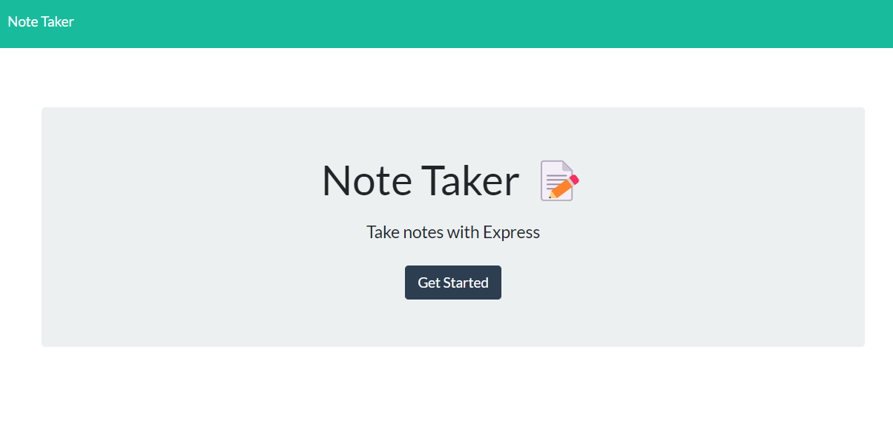

# express.js-note-taker

## Table of Contents
1. [Description](#description)
2. [Installation](#installation)
3. [Visuals](#visuals)
4. [License](#license)

## Description
[Deployed Application](
This application provides the user with note taking platform, utilizing Express.js as an npm module and facilitating data requests and responses. Demonstrative of a mock back-end process, this application uses a JSON file to save/store information. 

## Installation
Run 'npm i' within the console, located at the root level of the directory. This will pull in the necessary node modules/packages.

Following the package install, run node 'server.js' in the console to initiate server interaction.

This will open a port at localhost:3000, accessible when 'localhost:3000' searched in browser, or opened via link in console.

## Visuals

## License
This application is licensed with the MIT License.